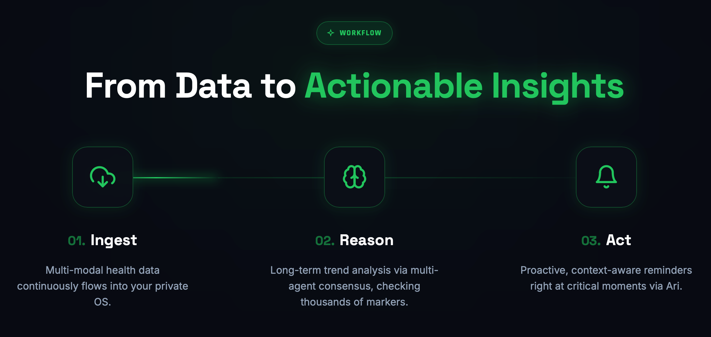
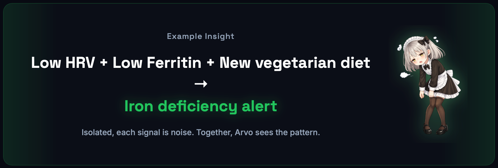

<h1 align="center">OpenVitals</h1>

<p align="center">
  <strong>为主动式 wellness 应用打造的 agent-native 健康操作系统</strong>
</p>

<p align="center">
  <a href="https://github.com/arvohealth-ai/OpenVitals/actions/workflows/ci.yml"></a>
  
  
</p>

<p align="center">
  
  
  
  
  
</p>

<p align="center">
  
  
  
</p>

<p align="center">
  <a href="./README.md">English</a> |
  <a href="./README.zh-CN.md">简体中文</a>
</p>

OpenVitals 是一个面向个人 wellness 应用的 agent-native 健康数据层。
它从手机、穿戴设备和各家 provider API 把数据收上来，明确记录每条数据的来源（provenance）
和新鲜度（freshness），再推导出可以解释、可以审计的 wellness 状态，最后通过应用、
MCP 工具、OpenClaw workspace、SDK 和本地 agent 安全地暴露出去。

它要解决的，正是健康 agent 在真实场景里最容易翻车的那几个问题：数据过期、镜像记录被
重复计算、把 provider summary 当成原始流式数据，以及说不清来源的黑盒分数。

<p align="center">
  
</p>

> OpenVitals 是 wellness 基础设施，不是诊断系统，也不是医疗器械，
> 不应该被用在临床决策里。

## ARVO 的开源核心

[ARVO](https://arvohealth.ai) 既是一套主动式健康 OS，也是一整套产品体验：它把穿戴设备、
化验数据和日常习惯串到一起，让健康陪伴 agent 能发现真正有意义的变化，并推动用户去行动。
Ari 是 ARVO 推出的第一个健康陪伴 agent。

OpenVitals 是这个方向下的开源核心，专门做健康 agent 想被信任之前必须有的那一层可复用基础设施：

- 对接 Apple Health、Apple Watch、Oura、WHOOP、Health Connect，以及未来更多的 provider；
- 保留 provenance、freshness、source priority 和 dedupe 证据；
- 把 provider 延迟、镜像记录、陈旧数据和缺失信号都明确告诉 agent；
- 通过 REST、MCP、SDK、OpenClaw workspace 和移动端 collector 示例，输出一致的数据语义。

ARVO 的产品在这一层之上再做主动式教练、提醒和 companion-agent 工作流；OpenVitals
自己只关心数据层、runtime 语义和开发者接口。

<p align="center">
  
</p>

## 为什么需要它

多数健康集成做到 “API 连上了” 就停了。OpenVitals 想再往前走一步：

- **诚实的数据语义**：每条记录都附带 granularity、latency、source、confidence、freshness 和 capture mode。
- **Agent-safe 输出**：MCP 和 REST 会明确告诉你这份数据是 delayed、mirrored、stale、missing 还是 incomplete。
- **Local-first runtime**：单节点 SQLite 就够覆盖本地开发、自托管和硬件 QA。
- **可解释分数**：recovery、sleep、strain、circadian 和 alert 全都能回溯到具体证据。
- **Provider dedupe**：direct Oura/WHOOP 可以盖掉那些镜像写进 Apple Health 的副本，同时不破坏原始审计轨迹。
- **移动端采集路径**：iPhone HealthKit 是 Apple Health 的主连接器；Apple Watch 的实时心率是可选路径，只在 active workout session 期间生效。

## 快速开始

要求：

- Node.js 22+
- pnpm 10+

```bash
pnpm install
pnpm demo
```

另起一个终端：

```bash
export OPENVITALS_AGENT_TOKEN=ov_demo_user_ada_derived

curl -H "Authorization: Bearer $OPENVITALS_AGENT_TOKEN" \
  "http://127.0.0.1:3000/v1/scores?userId=user_ada"
```

本地工具入口：

- Dashboard：<http://127.0.0.1:3000/dashboard>
- API playground：<http://127.0.0.1:3000/playground>
- OpenAPI JSON：<http://127.0.0.1:3000/v1/openapi.json>

## 你可以用它做什么

- 一个数据过期时不会乱下结论的本地个人健康 agent。
- 一个用 profile 隔离凭据、带 scoped token 的家庭恢复看板。
- 一个给其他 agent 提供 freshness-aware 健康上下文的 MCP server。
- 一个上传 HealthKit / Health Connect 样本的移动 companion app。
- 一个新的穿戴设备或健身平台 provider adapter。
- 一个跑 daily brief 和 recovery check-in 的 OpenClaw workspace。

## 仓库结构

| 路径 | 用途 |
| --- | --- |
| `apps/api` | Fastify API、SQLite runtime state、OAuth/connect flow、SSE/webhook、OpenAPI 和 explainability endpoint。 |
| `apps/dashboard` | 用来查看 connector state、scores、alerts、freshness 和 provenance 的工程 dashboard。 |
| `apps/devplayground` | 本地接口联调用的浏览器 playground。 |
| `packages/contracts` | 共享的 Zod schema 和对外的 TypeScript contract。 |
| `packages/runtime` | ingest、dedupe、source precedence、baseline、scoring、workflow 和 explainability 整条 pipeline。 |
| `packages/mcp` | 暴露 daily brief、recovery status、sync status、freshness 和 explanation 工具的 MCP server。 |
| `packages/sdk-ts`, `packages/sdk-py` | TypeScript 与 Python SDK。 |
| `packages/collector-*` | iOS、Android、React Native、Flutter，以及共享生命周期逻辑的移动端 collector 原语。 |
| `packages/llm` | LLM provider adapter 层，包括 OpenRouter smoke 支持。 |
| `providers/*` | Apple Health、Health Connect、Oura、WHOOP、Garmin、Strava 的 provider adapter。 |
| `examples/*` | 可直接跑的示例和移动端模板。 |
| `docs/*` | quickstart、硬件 QA、凭据配置、OpenClaw、OpenRouter 和自托管相关文档。 |

## 数据语义

OpenVitals 把健康数据当作 “带上下文的证据” 来对待，而不只是几个数字。

| 字段 | 取值 | 为什么重要 |
| --- | --- | --- |
| `dataGranularity` | `provider_payload`, `sample`, `episode`, `daily_summary`, `score`, `live_signal` | 把 provider payload、平台样本、时间窗、汇总、分数和真正的实时信号区分开。 |
| `latencyClass` | `live`, `near_realtime`, `delayed_sync`, `daily`, `manual` | 防止 agent 拿延迟数据冒充当前状态。 |
| `connectionMode` | `cloud_oauth`, `mobile_permission`, `device_pairing`, `mock` | 说明数据是从哪条路径进来的。 |
| `captureMode` | `direct`, `mirrored`, `manual`, `mock` | Oura/WHOOP 同时写入 Apple Health 时，避免同一条数据被重复计算。 |

Provider 之间的边界写得很清楚：

- Apple Watch 实时心率走的是可选的 live workout collector 路径，底层基于 `HKWorkoutSession` 和 `HKLiveWorkoutBuilder`。
- 历史 Apple Health / Apple Watch 数据通过 iPhone HealthKit，以 sample 或 episode 的形式上传，不是服务端实时流。
- Oura 云 API 给的是 provider-mediated 的时间序列、日汇总和分数，不是连续的原始传感器流。
- WHOOP 云 API 给的是 provider-mediated 的 recovery、sleep、workout、strain、HRV、resting heart-rate 和 zone summary，不是连续的原始心率流。

## Provider 状态

| Provider | 连接方式 | 数据形态 | 状态 | 说明 |
| --- | --- | --- | --- | --- |
| Apple Health / Apple Watch | iPhone HealthKit + 可选 Watch workout app | samples、episodes、daily summaries、live workout HR | `sdk-ingest-ready` | iPhone app 是主连接器，Watch app 只在 active workout 期间拿心率。 |
| Health Connect | Android device permission | samples 和 summaries | `prototype` | 等 iOS 路径稳定后再跑 Android smoke。 |
| Oura | OAuth 云 API 或 env-token 开发路径 | provider payloads、samples、daily summaries、scores | `real-data-beta` | 延迟数据，provider-mediated。同一时间窗里 direct Oura 应该压过 mirrored Apple Health。 |
| WHOOP | OAuth 云 API 或 env-token 开发路径 | provider payloads、summaries、scores | `real-data-ready` | 延迟数据，provider-mediated。不声称提供 continuous raw HR streaming。 |
| Garmin | mock | provider payloads 和 summaries | `demo-only` | 只用于 demo。 |
| Strava | mock | workout payloads 和 summaries | `demo-only` | 只用于 demo。 |

跑一下 `pnpm docs:generate`，就能在本地生成 provider 和 MCP reference 文档。

## Runtime 模式

`demo` 模式会预置一份固定的演示数据和 token：

```bash
pnpm demo
```

`live` 模式不预置任何用户状态，适合走真实连接流程：

```bash
OPENVITALS_MODE=live pnpm --filter @openvitals/api demo
```

初始化一个 live 用户：

```bash
curl -X POST "http://127.0.0.1:3000/v1/live/bootstrap" \
  -H "x-openvitals-admin: ${OPENVITALS_ADMIN_TOKEN:-openvitals-dev-admin}" \
  -H "content-type: application/json" \
  -d '{"userId":"user_live","name":"Live User","timezone":"UTC","createTokens":true}'
```

runtime 的 SQLite 状态默认放在 `.openvitals/openvitals.sqlite`，要换路径可以通过
`OPENVITALS_DB_PATH` 覆盖。

## 真实数据接入

先把环境变量模板复制一份，只填你当前要用的 provider：

```bash
cp .env.example .env.local
```

建议读一下：

- [文档总览](./docs/README-zh.md)
- [真实数据快速开始](./docs/real-data-quickstart-zh.md)
- [凭据获取清单](./docs/credentials-setup-zh.md)
- [iOS Companion 指南](./docs/ios-companion-guide-zh.md)
- [iOS 硬件 QA Runbook](./docs/ios-hardware-runbook-zh.md)
- [硬件测试计划](./docs/hardware-test-plan-zh.md)
- [自托管](./docs/self-hosting-zh.md)
- [OpenRouter LLM](./docs/openrouter-llm-zh.md)
- [OpenClaw E2E](./docs/openclaw-e2e-zh.md)

千万不要把 `.env`、`.env.*`、OAuth code、access token、refresh token、provider client secret、
Apple 设备标识符或者真实的 HealthKit 导出数据提交进仓库。

## OpenClaw 与 MCP

上游 OpenClaw 仓库以 submodule 的形式钉在 `vendor/openclaw`。

```bash
git submodule update --init --recursive
pnpm openclaw:e2e
```

自动化 E2E 会启动 demo API，在一份隔离的 OpenClaw config 里注册 OpenVitals MCP server，
生成 skill/workspace 资产，再通过 MCP stdio 调用 `health.sync_status` 和 `health.daily_brief`。

生成一个 OpenClaw daily brief workspace：

```bash
pnpm --filter @openvitals/openclaw-skill exec openvitals-openclaw-init \
  --out-dir . \
  --api-base-url http://127.0.0.1:3000 \
  --user-id user_ada \
  --timezone UTC \
  --daily-cron "0 8 * * *" \
  --weekly-cron "0 9 * * 0" \
  --webhook-secret local-dev-secret
```

## 开发

```bash
pnpm docs:generate
pnpm build
pnpm test
pnpm smoke:e2e
pnpm typecheck
pnpm smoke:apple-health
pnpm provider:new fitbit
```

CI 会跑 docs generation、build、unit tests、smoke E2E 和 typecheck。

给贡献者的几条边界：

- score 的计算要保持 deterministic 而且可解释。
- raw/provider payload 历史和 normalized records 都要保留。
- 不要在 agent-facing 输出里把 stale、mirrored、missing 或 incomplete 数据藏起来。
- 不要削弱 token scope、OAuth、webhook signing 或 admin boundary。
- 不要做出任何诊断、治疗或医疗器械类的声明。

更多内容看 [CONTRIBUTING.md](./CONTRIBUTING.md)。

## 许可证

OpenVitals 以 source-available 的形式发布，非商业用途遵循
[PolyForm Noncommercial License 1.0.0](https://polyformproject.org/licenses/noncommercial/1.0.0)。
商业使用需要单独申请商业授权，见 [COMMERCIAL.md](./COMMERCIAL.md)。

它不是 OSI 认证的开源许可证——项目本身并没有授出无限制的商业使用权。

## 免责声明

OpenVitals 面向的是 wellness、coaching、自我追踪和 agent context 这类场景。
它不是诊断系统，不是医疗器械，也不能替代临床判断。
任何和健康有关的结论，在拿出来之前都应该先把 provenance、confidence 和 freshness 摆清楚。
